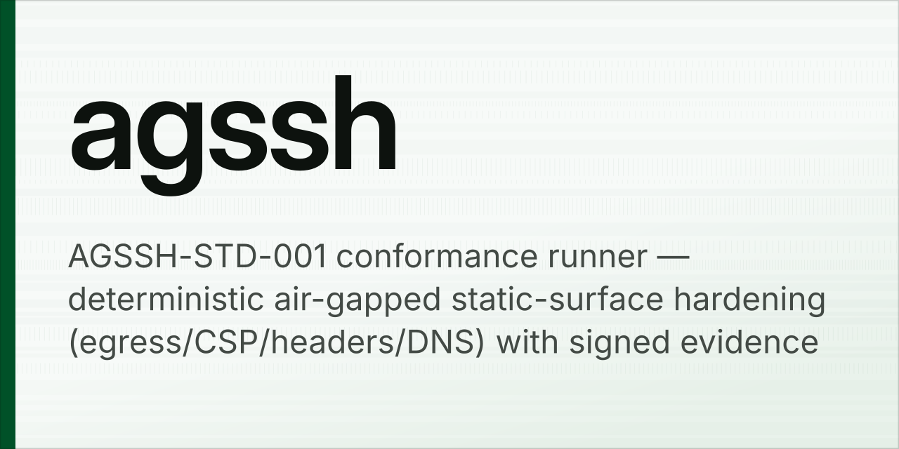
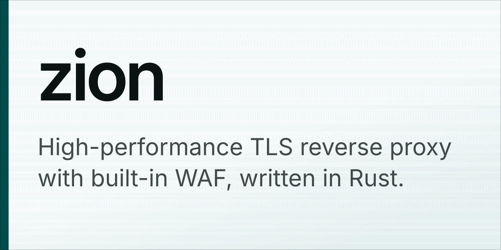

# github-social-preview-generator

**Enterprise-looking social previews for every repository you own — generated
offline, byte-for-byte reproducible, and tracked without handing any CI job a
credential.**

GitHub renders a generic card for a repository with no social preview: your
avatar, the name, the description, on grey. This generates a real one instead —
procedurally, from a manifest — and keeps a public, addressable copy of every
image so a README, an issue or a slide deck can point straight at it.

<p align="center">
  
  
</p>
<p align="center">
  
  
</p>

One layout, one background, one typeface. The only thing that changes between
repositories is the hue — derived from the repository's own name — so the set
reads as one house style rather than as a generator showing off.

The design answers how the image is actually seen. It is read in a feed at
roughly a third of its size, so nothing on it is smaller than 30px on the
1280px canvas: no chips, no handle, no URL, no badge. It sits on a white page,
so the coloured spine gives it an edge that survives any thumbnail. And the
description is never cut — the layout solves for both type sizes so the whole
sentence fits.

---

## What makes it different

**It never touches the network.** Not for fonts, not for colours, not for
images. Text is drawn as vector outlines from glyph packs that ship inside the
package, so no font has to be installed and no font service is called. The test
suite proves it: it monkeypatches `socket` to raise on any connection attempt
and renders a card anyway.

**It is reproducible.** The same manifest entry produces the same SVG, byte for
byte, on any machine and any supported Python. Randomness comes from a
SHA-256 counter stream seeded by the repository name, never from `random`.
`previews.lock.json` records the digest of every input and output, and
`gspg build --check` fails if anything drifted.

**It leaks nothing.** No analytics, no telemetry, no third-party asset, no
script — in the images, in the generator, or in the published gallery. The
gallery is a static page under a `default-src 'none'` policy that loads only
same-origin files.

**It needs no secrets.** The coverage tracker reads each repository's public
`og:image` tag, exactly as a link unfurler would. No token, no
`GITHUB_TOKEN`, nothing in Actions secrets, nothing that could leak from a
public workflow log.

**Zero dependencies.** Standard library only. The single external requirement
is an SVG rasteriser on `PATH`, and `gspg doctor` tells you which ones it found.

---

## Quick start

```bash
git clone https://github.com/fabriziosalmi/github-social-preview-generator
cd github-social-preview-generator

# One prerequisite: something that turns SVG into PNG.
#   macOS   brew install librsvg
#   Debian  sudo apt install librsvg2-bin
#   Rust    cargo install resvg
make doctor

# Build a manifest from your public repositories, then render every one.
PYTHONPATH=src python3 -m gspg import YOUR-GITHUB-NAME
make build

# See which repositories still show GitHub's default card.
make audit
```

Rendered images land in `previews/png/`; the intermediate SVG goes to
`previews/svg/`, which is not committed because `previews.lock.json` already
records the digest of every one.

Installing the package puts a `gspg` command on your path:

```bash
pip install .
gspg --help
```

### One-off, without a manifest

```bash
gspg preview owner/name \
  --description "What it does, in one sentence." \
  --accent teal
```

---

## The manifest

`previews.json` is the source of truth. It is plain JSON so the standard
library can read it everywhere, and `schema/previews.schema.json` gives editors
completion and validation.

```json
{
  "$schema": "./schema/previews.schema.json",
  "version": 1,
  "defaults": {},
  "repositories": [
    {
      "repo": "fabriziosalmi/certmate",
      "description": "Automated certificate management with ACME and DNS challenges.",
      "language": "Python",
      "license": "MIT",
      "topics": ["tls", "acme", "pki"],
      "accent": "emerald"
    }
  ]
}
```

| Field | Meaning |
| --- | --- |
| `repo` | `owner/name`. The only required field. |
| `title` | Headline. Defaults to the repository name. |
| `description` | Sub-headline. Never truncated. Written by hand once, never overwritten by `gspg import`. |
| `accent` | A hue name, a hue in degrees, or a hex colour. Drives the spine and the paper tint. |
| `saturation` | `0`–`2`. Scales chroma across the palette; `0` is monochrome. |
| `pattern` | Background field. Defaults to `strata` for every repository. |
| `seed` | Overrides the seed — change it to reroll the colour without renaming anything. |
| `skip` | Exclude from builds and audits. |
| `language`, `license`, `topics` | Shown in the gallery, **not** on the image: at feed size they would be unreadable. |

The hue is a pure function of the seed, so it is stable: a repository does not
change colour because you rebuilt it.

`gspg import` refreshes only what GitHub knows — description, language, licence,
topics — and leaves every design choice alone. Re-running it is safe.

---

## The card

| | |
| --- | --- |
| Canvas | 1280×640, which is what GitHub renders. Not 16:9 — a 16:9 image gets letterboxed. |
| Title | `InterDisplay-SemiBold`, black, 84–184px, solved per repository, at most two lines. |
| Description | `Inter-Regular`, 30–64px, solved per repository, **never truncated**. |
| Ground | Near-white stock, tinted a trace of the repository's hue. |
| Texture | The `strata` field, seeded from a constant so the form is identical everywhere. |
| Edge | A 22px spine in the repository's accent, plus a hairline. |

The two type blocks compete for one fixed height, so neither size is a
constant. The title claims space first and the description takes the largest
size at which its whole text still fits. Solving in the other order produces a
headline within a few points of its own subtitle, at which point the card reads
as two paragraphs rather than as a name with an explanation under it.

Eight other background fields ship — `topography`, `orbits`, `constellation`,
`flowlines`, `lattice`, `ridgeline`, `halftone`, `precision-grid` — and a
repository can name one. It will then stop matching its neighbours, which is
the point of having a default. `gspg list` prints them with the accent names.

## How it works

### Text is geometry, not text

`tools/fontlib.py` is a small TrueType reader: `glyf` outlines including
composite glyphs, `cmap` formats 4 and 12, `hmtx` advances, and real pair
kerning out of `GPOS` (lookup type 2, formats 1 and 2, including through type 9
extensions). `tools/build_glyphpack.py` runs it over the pinned upstream fonts
and emits a compact JSON pack — outlines as relative SVG paths in font units,
advances, and roughly 8,000 kerning pairs per face.

At render time `gspg/typography.py` reads only those packs. It measures,
kerns, tracks, wraps and emits one `<path>` per line. Nothing asks the operating
system for a font, which is why the same input produces the same pixels on a
machine with no fonts installed at all.

Line breaking is not naive. Titles are wrapped by a small dynamic program that
minimises squared slack, so a two-line headline does not end in an orphan; and
because repository names like `cloudflare-backup-actions` are single words wider
than any sensible column, breaks are allowed after hyphens, slashes and
underscores. Width is then checked line by line, not just the line count, so
nothing can overflow the frame.

### Colour is perceptual

Palettes are built in OKLCH, not HSL. A repository name hashes to a hue on a
curated wheel, and the whole palette is derived around it at fixed lightness and
chroma — so rotating the hue produces a sibling, not a different-looking design.
Out-of-gamut colours are mapped by reducing chroma while lightness and hue hold,
the way CSS Color 4 specifies, instead of clipping channels.

Text colours are then nudged until they clear a contrast floor: 7:1 for the
headline (WCAG AAA) and 4.5:1 for secondary text. A social card is read at a
glance, often on a phone in daylight, so the stricter bar is the right one. The
test suite asserts every generated palette clears it, in both modes, for every
named accent. On the card itself the type is near-black on near-white, so it
clears the bar by a wide margin whatever the hue.

### The artwork is procedural and bounded

Backgrounds come from seeded Perlin noise with fractional Brownian motion and
domain warping, turned into contours by marching squares, Poisson-disc point
sets, streamline integration, or lattices. Every generator caps its own element
count; a background that balloons to a megabyte is a bug. The card seeds its
field from a constant rather than from the repository, so the texture is
identical everywhere and only its hue moves.

### No SVG filters, ever

`feTurbulence` and `feGaussianBlur` are specified loosely enough that librsvg,
Chromium and resvg disagree about the result — which would quietly destroy the
reproducibility claim. So there are none. Softness comes from gradients and
stacked translucent geometry, and film grain is explicit one-pixel marks placed
by the seeded stream. It costs a few thousand nodes and renders identically
everywhere.

---

## Tracking coverage without secrets

GitHub has **no API for social previews** — you cannot read one, and you cannot
set one. Uploading is a manual step in repository settings, and any tool that
claims otherwise is driving a browser.

Reading is another matter. A repository page always carries an `og:image`, and
the host tells you everything:

| `og:image` host | Meaning |
| --- | --- |
| `opengraph.githubassets.com` | GitHub's generated card — **no** custom preview |
| `repository-images.githubusercontent.com` | An uploaded preview |

So `gspg audit` fetches the public page — unauthenticated, the same request a
link unfurler makes — and reports the status of every repository, whether it
has been rendered locally, and what to do next.

```
+ fabriziosalmi/certmate                       custom preview
! fabriziosalmi/zion                           GitHub default  [rendered]
? fabriziosalmi/renamed-away                   not found

Coverage
  4/92 custom  88 default  0 not found  0 errors
```

```bash
make coverage          # writes COVERAGE.md and previews/coverage.json
gspg audit --strict    # exit 1 while anything is still uncovered
gspg audit --discover OWNER   # check every public repository, manifest or not
```

The scheduled workflow runs exactly this, publishes the table to the run
summary, and uploads it as an artifact. Its token is read-only and unused.
`make coverage` writes the same report to `COVERAGE.md` locally; it is not
committed, because it changes on every run and says nothing a reader of the
repository needs.

---

## Public storage

Two ways to reach an image, neither of which needs an image host or an account.

**Raw URLs.** The PNGs are committed, so every one has a stable address:

```
https://raw.githubusercontent.com/OWNER/REPO/main/previews/png/<owner>__<name>.png
```

**A gallery.** `make gallery` assembles `site/` — a self-contained static page
plus a copy of every image, an `index.json` for programmatic use, and nothing
else. No script, no web font, no third-party request; the stylesheet is a
same-origin file specifically so the page's own CSP can refuse `unsafe-inline`:

```
default-src 'none'; img-src 'self'; style-src 'self';
base-uri 'none'; form-action 'none'; frame-ancestors 'none'
```

`make serve` runs it locally, and the Pages workflow publishes it on every
change that would alter the gallery, using the workflow's own short-lived OIDC
token — so there is still nothing in repository secrets. It needs Pages enabled
with `Settings → Pages → Source: GitHub Actions`. The raw URLs work without any
of this.

---

## Reproducibility

`previews.lock.json` records, per repository, the digest of every input that can
affect the output — the manifest entry, the canvas size, a fingerprint of the
glyph packs, and a render epoch that is bumped whenever a change to this package
would alter existing artwork — alongside the digests of the SVG and PNG
produced, and which rasteriser produced them.

```bash
gspg build          # skips entries whose inputs are unchanged
gspg build --force  # re-render everything
gspg build --check  # verify against the lock file, change nothing, exit 1 on drift
```

CI runs `--check` on every push. **SVG output is guaranteed identical across
machines; PNG bytes additionally depend on the rasteriser build**, which is why
the backend and its version are recorded rather than glossed over, and why the
branch gate compares SVG digests.

---

## Airgap and privacy posture

Only two things ever open a socket, and neither is the renderer:

| Command | Network | Credentials |
| --- | --- | --- |
| `gspg build`, `preview`, `gallery`, `list`, `doctor`, `init` | **none** | none |
| `gspg audit` | public repository pages | **none** |
| `gspg import` | public GitHub API | **none** |
| `tools/vendor_fonts.py` | pinned font archives, once | none |

`tools/vendor_fonts.py` is a one-time bootstrap and a clone does not need it:
the glyph packs it feeds are committed. It exists so the derivation from
upstream is auditable rather than asserted — it verifies the SHA-256 of each
archive **before** extracting anything, and the SHA-256 of each file inside it,
against `src/gspg/assets/fonts/fonts.lock.json`.

The published gallery is a static surface in the sense of
[AGSSH-STD-001](https://github.com/fabriziosalmi/agssh), and is built to be
checked as one: single origin, no runtime dependency to self-host because there
is none, a CSP with every fetch-directive locked to `'self'` or `'none'`,
`referrer: no-referrer`, no client storage, no service worker, no third-party
anything. Point `agssh` at the deployment and it should have nothing to say.

---

## Fonts and licensing

The generator is MIT. Images you produce are yours.

The glyph packs in `src/gspg/assets/fonts/` are derived from **Inter 4.1**,
under the SIL Open Font License 1.1, and remain under it. Two faces ship —
`InterDisplay-SemiBold` and `Inter-Regular` — because those are the two the card
draws with. The licence text sits alongside them and [`NOTICE`](NOTICE) records
the provenance. The upstream `.ttf` files are build inputs and are not
committed.

---

## Development

```bash
make help          # every target
make test          # 168 tests, standard library only
make lint          # byte-compile plus the house style check
make glyphs        # rebuild the glyph packs from vendor/fonts
make fonts         # fetch and verify the pinned fonts, then rebuild the packs
make clean
```

Supported on Python 3.9 through 3.13. Rasterisers, in preference order: `resvg`,
`rsvg-convert`, `inkscape`, headless Chromium.

---

## Limitations

* **Uploading is manual.** GitHub exposes no API for it. One image, one drag,
  under `Settings → Social preview`. Everything up to that point is automated,
  and the audit tells you exactly which ones are still waiting.
* **Latin script only.** The glyph packs cover Latin-1 plus Latin Extended-A and
  the punctuation a repository card uses. Anything outside that set renders as a
  visible placeholder rather than silently vanishing. Widening the charset is a
  one-line change in `tools/build_glyphpack.py` and a rebuild.
* **A very long description shrinks the title.** Nothing is ever cut, but a
  200-character sentence takes its room from the headline. Writing a shorter
  `description` in the manifest — the repository keeps its own on GitHub — is
  usually the better answer.
* **No right-to-left or complex shaping.** There is no shaping engine here, only
  kerned linear layout.
* **PNG bytes are backend-specific.** See [Reproducibility](#reproducibility).
